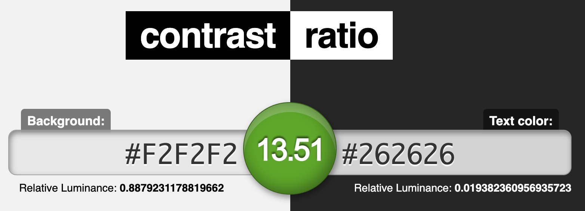

# Assignment #06: Interface Design
Kelly Zhong, DH 110
  

## Overview
**Project Description**  
The goal of my project is to redesign the CNN.com website to help users more easily consume news. Specifically, like many news websites, CNN.com is hard to navigate because of the overwhelming amount of content and the lack of clear organization and layout design of that content. With my project, I hope to add features that will improve the website's organization and help users to find desired content.
  

**Purpose and Process** 
The purpose of creating the prototype of this project is to understand how my proposed features can fit within the existing product and its design system. To create the prototypes, I first took a screenshot of the website screen and used Figma to recreate it with the same fonts and colors. Then, I added my feature on top of the designs in a way that makes it natural within the system. I looked at the website for design styles, such as font size, color, and weight, as well as drop shadows, button types, corner radiuses, etc. 
  

## Tasks
My interactive prototype supports the following tasks:
1. Clicking the "Customize" button.
2. Choosing desired settings.
3. Clicking "Apply".
4. Viewing the new screen with customized settings.
  

## Screen Designs
User Interface  

  
Color Variations (for screen #4 labeled "Desktop-4") 
<em>The color variations below are as follows: Variation 1- light mode, Variation 2- dark mode on the added feature (the "World" and "US" news sections), Variation 3- hue variation, and Variation 4- dark mode on the whole screen.

  

## Tests
**Impression test**  
Comments from classmates:

Summary of findings: 

**Accessibliity (color-contrast) check**  

  

## Design System
- summary of graphic design 
- how you made decisions 
-   Description of your decision making of the graphical interface design, including the choice of the color scheme and note if you considered/checked accessibility color contrast
