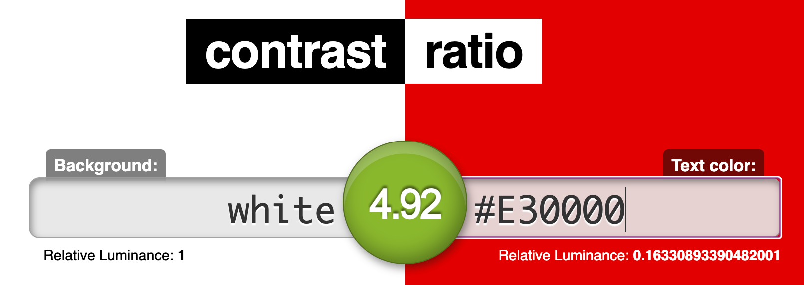
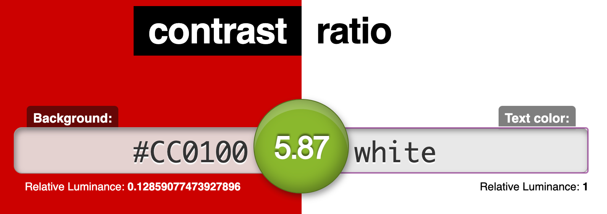

# Assignment #06: Interface Design
Kelly Zhong, DH 110
  

## Overview
**Project Description**  
My project is a redesign of the CNN.com website through the addition of features to help users more easily consume news. Specifically, like many news websites, CNN.com is hard to navigate because of the overwhelming amount of content. With this prototype, I will add a "Customize" feature that will give users the ability to filter the homepage to see topics that they are interested in. By doing so, the website's organization will improve and users will be able to personalize their news feed to find desired content.
  

**Purpose and Process** 
The purpose of creating the prototype of this project is to understand how my proposed features can fit within the existing product and its design system. To create the prototypes, I first took a screenshot of the website screen and used Figma to recreate it with the same fonts and colors. Then, I added my feature on top of the designs in a way that makes it natural within the system. I looked at the website for design styles, such as font size, color, and weight, as well as drop shadows, button types, corner radiuses, etc. 
  

## Tasks
My interactive prototype supports the following tasks:
1. Clicking the "Customize" button.
2. Choosing desired settings.
3. Clicking "Apply".
4. Viewing the new screen with customized settings.
  

## Screen Designs
**User Interface**  

   
**Color Variations** (for screen #4 labeled "Desktop-4") 
<em>The color variations below are as follows: Variation 1- light mode, Variation 2- dark mode on the added feature (the "World" and "US" news sections), Variation 3- hue variation, and Variation 4- dark mode on the whole screen.</em>   

  

## Tests
**Impression test**  
Comments from classmates:  

Summary of findings:  
The impression test with my classmates today went well! They were really kind with their comments. The main findings that I took from this activity was that (1) the organization of the content fits within the existing CNN design system, and that (2) I could look into expanding the "Customize" feature and adding more filter options (like dates). Overall, the impression test was a great experience!   

**Accessibliity (color-contrast) check**  

  

## Design System

Description:  
For the color scheme, I decided to stick with CNN's existing brand colors of red, black, and gray. Though I tried out a green variation (I tried green because it is opposite of red on the color wheel), I thought that it looked out of place and didn't fit the vibe of the brand. After eye-dropping the colors on the existing CNN website, I noticed that they actually use two different shades of red — one darker, for their logo and other design elements (like the red circle next to the "LIVE TV" and the background box on the "LIVE UPDATES" label on the first picture), and one brighter, for text. I checked the color contrast for each color. As for the feature I designed, I did so while taking into consideration existing design rules on the website. For example, I made sure the drop shadow and the cornor radius on the dropdown that I designed matched the existing one on the website. 

## Interactive Prototype
Here is the <a href="https://www.figma.com/file/p1gaHYkho81C894hVpk6tl/DH-110?node-id=29%3A2">link</a> to the prototype. There are two features that I designed and prototyped, and the prototype starts at the first feature. To view the prototype of the second feature, click anywhere on the last screen of the first feature or click on the profile icon at any point.

Here are two gifs that demonstrate each prototype:  
**Feature 1: Customize Feed**  

  

**Feature 2: Accessible Newsfeed**  

## Wireflow (Diagram)

  

## Cognitive Walkthrough
Will perform during class today.

## Reflection

_(Reflection on creating the prototype)_
To create the prototype, I put myself in the shoes of the users and considered the steps that they would take when completing the tasks. This also helped me to prevent dead ends or any confusing interactions. The process of creating the prototype was smooth, but tedious in that I had to manually recreate all of the article titles and subtitles, as well as other design elements in order to customize the screens for the user.

_(Reflection on Cognitive Walkthrough)_
Will complete after class today.
